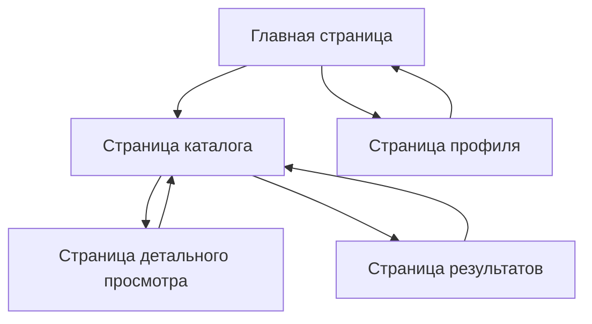

# Техническое задание - Frontend приложение "NIYAT"

## 1. Обзор продукта

Frontend приложение "NIYAT" - это веб-приложение с современным интерфейсом. Приложение предоставляет пользователям удобный и интуитивно понятный интерфейс для взаимодействия с различными функциями.

Приложение решает задачу создания качественного пользовательского интерфейса с современным дизайном и удобной навигацией.

### ⚠️ КРИТИЧЕСКИ ВАЖНОЕ ТРЕБОВАНИЕ К ДИЗАЙНУ

**ВСЕ элементы интерфейса должны быть реализованы СТРОГО по дизайну из Figma:**
- Ссылка на макет: https://www.figma.com/design/WsuGHQ0qKgrPM3aoE93k3D/Niyat?node-id=0-1&p=f&t=RlCCgDPwClhcImWz-0
- НИКАКОЙ САМОДЕЯТЕЛЬНОСТИ не допускается
- Каждый компонент, цвет, размер, отступ должен точно соответствовать макету
- Любые отклонения от дизайна Figma категорически запрещены
- Дизайн должен быть взят ИСКЛЮЧИТЕЛЬНО из указанного макета

## 2. Основные функции

### 2.1 Пользовательские роли

| Роль | Метод регистрации | Основные права |
|------|-------------------|----------------|
| Пользователь | Стандартная регистрация | Может просматривать контент, использовать основные функции |

### 2.2 Модули функций

Наши требования к приложению состоят из следующих основных страниц:

1. **Главная страница**: отображение основного контента, навигация по приложению
2. **Страница каталога**: просмотр элементов каталога, фильтрация и поиск
3. **Страница детального просмотра**: подробная информация об элементе
4. **Страница результатов**: отображение результатов поиска или фильтрации
5. **Страница профиля**: информация о пользователе, настройки

### 2.3 Детали страниц

| Название страницы | Название модуля | Описание функции |
|-------------------|-----------------|------------------|
| Главная страница | Основной контент | Отображение главных элементов интерфейса |
| Главная страница | Навигация | Меню для перехода между разделами приложения |
| Главная страница | Информационный блок | Отображение основной информации |
| Страница каталога | Список элементов | Отображение элементов каталога с основной информацией |
| Страница каталога | Фильтры | Инструменты для фильтрации и поиска |
| Страница каталога | Сортировка | Возможность сортировки элементов |
| Страница детального просмотра | Подробная информация | Детальное описание выбранного элемента |
| Страница детального просмотра | Дополнительные данные | Расширенная информация и характеристики |
| Страница результатов | Результаты поиска | Отображение найденных элементов |
| Страница результатов | Пагинация | Навигация по страницам результатов |
| Страница профиля | Информация пользователя | Отображение данных пользователя |
| Страница профиля | Настройки | Управление настройками профиля |

## 3. Основные процессы

**Основной пользовательский поток:**

1. Пользователь открывает приложение
2. Просматривает главную страницу
3. Переходит в каталог
4. Использует фильтры для поиска нужных элементов
5. Просматривает детальную информацию
6. Управляет настройками в профиле

## 4. Дизайн пользовательского интерфейса

### 4.1 Стиль дизайна

**Основные элементы дизайна:**
- Основные цвета: синий (#007AFF), белый (#FFFFFF), серый (#F2F2F7)
- Акцентные цвета: зеленый для успешных действий, красный для предупреждений
- Стиль кнопок: скругленные углы, современные градиенты
- Шрифты: SF Pro Display для заголовков, SF Pro Text для основного текста
- Размеры шрифтов: 28px для заголовков, 16px для основного текста, 14px для вспомогательного
- Стиль макета: карточный дизайн с тенями, адаптивная навигация
- Иконки: outline стиль, размер 24px

### 4.2 Обзор дизайна страниц

| Название страницы | Название модуля | UI элементы |
|-------------------|-----------------|-------------|
| Главная страница | Основной контент | Карточки с градиентным фоном, крупные заголовки |
| Главная страница | Навигация | Панель навигации с иконками и подписями |
| Главная страница | Информационный блок | Карточка с основной информацией |
| Страница каталога | Список элементов | Сетка карточек элементов |
| Страница каталога | Фильтры | Боковая панель с элементами фильтрации |
| Страница детального просмотра | Подробная информация | Развернутая карточка с деталями |
| Страница результатов | Результаты | Список найденных элементов |
| Страница профиля | Информация | Карточка профиля с аватаром |

### 4.3 Адаптивность

Приложение оптимизировано для различных устройств с поддержкой touch-взаимодействия. Дизайн адаптируется под различные размеры экранов от мобильных устройств до десктопов.
