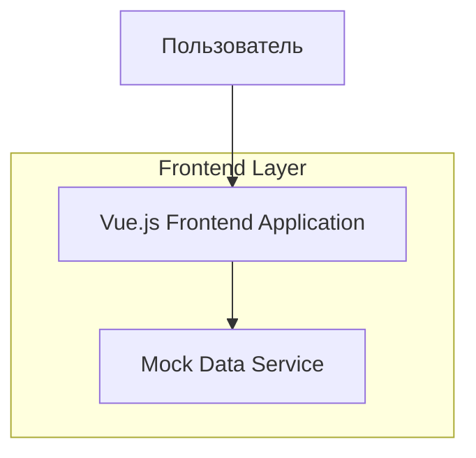
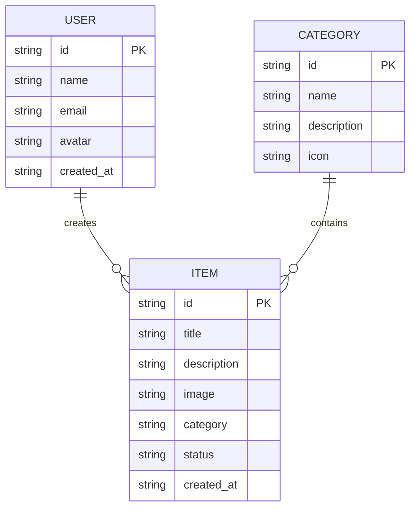

# Техническая архитектура - Frontend приложение "NIYAT" на Vue.js

## ⚠️ КРИТИЧЕСКИ ВАЖНОЕ ТРЕБОВАНИЕ К ДИЗАЙНУ

**ВСЕ элементы интерфейса должны быть реализованы СТРОГО по дизайну из Figma:**
- Ссылка на макет: https://www.figma.com/design/WsuGHQ0qKgrPM3aoE93k3D/Niyat?node-id=0-1&p=f&t=RlCCgDPwClhcImWz-0
- НИКАКОЙ САМОДЕЯТЕЛЬНОСТИ не допускается
- Каждый компонент, цвет, размер, отступ должен точно соответствовать макету
- Любые отклонения от дизайна Figma категорически запрещены
- Дизайн должен быть взят ИСКЛЮЧИТЕЛЬНО из указанного макета

## 1. Архитектурный дизайн



## 2. Описание технологий

- Frontend: Vue.js@3 + TypeScript + Vite + Pinia + Vue Router
- UI Framework: Tailwind CSS + Headless UI
- Mock Data: Локальные JSON файлы с заглушками
- Backend: Отсутствует (только заглушки)

## 3. Определение маршрутов

| Маршрут | Назначение |
|---------|------------|
| / | Главная страница с основным контентом |
| /catalog | Страница каталога с элементами |
| /item/:id | Страница детального просмотра элемента |
| /results | Страница с результатами поиска |
| /profile | Страница профиля пользователя |

## 4. Структура проекта

```
/src
├── components/           # Переиспользуемые компоненты
│   ├── ui/              # Базовые UI компоненты
│   ├── catalog/         # Компоненты для каталога
│   ├── item/            # Компоненты для элементов
│   └── common/          # Общие компоненты
├── views/               # Страницы приложения
│   ├── HomeView.vue
│   ├── CatalogView.vue
│   ├── ItemView.vue
│   ├── ResultsView.vue
│   └── ProfileView.vue
├── stores/              # Pinia хранилища
│   ├── catalog.ts
│   ├── user.ts
│   ├── items.ts
│   └── search.ts
├── services/            # Сервисы для работы с данными
│   ├── mockData.ts
│   └── storage.ts
├── types/               # TypeScript типы
│   ├── catalog.ts
│   ├── user.ts
│   ├── item.ts
│   └── common.ts
├── utils/               # Утилиты
│   ├── formatters.ts
│   ├── validators.ts
│   └── constants.ts
├── assets/              # Статические ресурсы
│   ├── images/
│   └── icons/
├── router/              # Конфигурация маршрутизации
│   └── index.ts
└── App.vue              # Корневой компонент
```

## 5. Модель данных (Mock)

### 5.1 Определение модели данных



### 5.2 TypeScript интерфейсы

```typescript
// types/user.ts
export interface User {
  id: string;
  name: string;
  email: string;
  avatar?: string;
  created_at: string;
}

// types/item.ts
export interface Item {
  id: string;
  title: string;
  description: string;
  image?: string;
  category: string;
  status: 'active' | 'inactive' | 'featured';
  created_at: string;
}

// types/catalog.ts
export interface Category {
  id: string;
  name: string;
  description: string;
  icon?: string;
}

// types/common.ts
export interface SearchResult {
  items: Item[];
  total: number;
  page: number;
  limit: number;
}
```

### 5.3 Mock данные

```typescript
// services/mockData.ts
export const mockCategories: Category[] = [
  {
    id: '1',
    name: 'Категория 1',
    description: 'Описание первой категории',
    icon: 'icon-1'
  },
  {
    id: '2',
    name: 'Категория 2',
    description: 'Описание второй категории',
    icon: 'icon-2'
  }
];

export const mockItems: Item[] = [
  {
    id: '1',
    title: 'Элемент 1',
    description: 'Описание первого элемента',
    image: 'image-1.jpg',
    category: '1',
    status: 'active',
    created_at: '2024-01-01T00:00:00Z'
  },
  {
    id: '2',
    title: 'Элемент 2',
    description: 'Описание второго элемента',
    image: 'image-2.jpg',
    category: '2',
    status: 'featured',
    created_at: '2024-01-02T00:00:00Z'
  }
];

export const mockUser: User = {
  id: '1',
  name: 'Пользователь',
  email: 'user@example.com',
  avatar: 'avatar.jpg',
  created_at: '2024-01-01T00:00:00Z'
};
```

## 6. Состояние приложения (Pinia)

```typescript
// stores/catalog.ts
import { defineStore } from 'pinia';
import { mockCategories, mockItems } from '@/services/mockData';

export const useCatalogStore = defineStore('catalog', {
  state: () => ({
    categories: mockCategories,
    items: mockItems,
    currentItem: null as Item | null,
    loading: false
  }),

  getters: {
    activeItems: (state) => 
      state.items.filter(item => item.status === 'active'),
    
    getItemById: (state) => 
      (id: string) => state.items.find(item => item.id === id),
      
    getItemsByCategory: (state) => 
      (categoryId: string) => state.items.filter(item => item.category === categoryId)
  },

  actions: {
    async fetchItems() {
      this.loading = true;
      // Имитация загрузки
      await new Promise(resolve => setTimeout(resolve, 1000));
      this.loading = false;
    },

    setCurrentItem(item: Item) {
      this.currentItem = item;
    },
    
    searchItems(query: string) {
      return this.items.filter(item => 
        item.title.toLowerCase().includes(query.toLowerCase()) ||
        item.description.toLowerCase().includes(query.toLowerCase())
      );
    }
  }
});
```

## 7. Компоненты

### 7.1 Основные компоненты

- `ItemCard.vue` - карточка элемента
- `CategoryCard.vue` - карточка категории
- `SearchBar.vue` - строка поиска
- `FilterPanel.vue` - панель фильтров
- `NavigationBar.vue` - навигация
- `Pagination.vue` - пагинация

### 7.2 UI компоненты

- `Button.vue` - кнопка
- `Card.vue` - карточка
- `Modal.vue` - модальное окно
- `Loading.vue` - индикатор загрузки
- `Badge.vue` - бейдж статуса
- `Input.vue` - поле ввода

## 8. Развертывание

### ⚠️ ОБЯЗАТЕЛЬНОЕ ТРЕБОВАНИЕ: ЗАПУСК ТОЛЬКО ЧЕРЕЗ DOCKER

**Фронтенд должен запускаться при проверке ИСКЛЮЧИТЕЛЬНО через Docker контейнеры.**

### 8.1 Docker конфигурация

**Dockerfile:**
```dockerfile
# Используем официальный Node.js образ
FROM node:18-alpine as build-stage

# Устанавливаем рабочую директорию
WORKDIR /app

# Копируем package.json и package-lock.json
COPY package*.json ./

# Устанавливаем зависимости
RUN npm ci --only=production

# Копируем исходный код
COPY . .

# Собираем приложение
RUN npm run build

# Продакшн стадия
FROM nginx:alpine as production-stage

# Копируем собранное приложение
COPY --from=build-stage /app/dist /usr/share/nginx/html

# Копируем конфигурацию nginx
COPY nginx.conf /etc/nginx/nginx.conf

# Открываем порт 80
EXPOSE 80

# Запускаем nginx
CMD ["nginx", "-g", "daemon off;"]
```

**docker-compose.yml:**
```yaml
version: '3.8'

services:
  niyat-frontend:
    build:
      context: .
      dockerfile: Dockerfile
    ports:
      - "3000:80"
    environment:
      - NODE_ENV=production
    volumes:
      - ./nginx.conf:/etc/nginx/nginx.conf:ro
    restart: unless-stopped
    container_name: niyat-frontend-app
```

**nginx.conf:**
```nginx
events {
    worker_connections 1024;
}

http {
    include       /etc/nginx/mime.types;
    default_type  application/octet-stream;
    
    server {
        listen 80;
        server_name localhost;
        root /usr/share/nginx/html;
        index index.html;
        
        # Обработка SPA маршрутов
        location / {
            try_files $uri $uri/ /index.html;
        }
        
        # Кэширование статических ресурсов
        location ~* \.(js|css|png|jpg|jpeg|gif|ico|svg)$ {
            expires 1y;
            add_header Cache-Control "public, immutable";
        }
    }
}
```

### 8.2 Команды для запуска

**Сборка и запуск через Docker Compose:**
```bash
# Сборка контейнера
docker-compose build

# Запуск приложения
docker-compose up -d

# Просмотр логов
docker-compose logs -f

# Остановка
docker-compose down
```

**Альтернативный запуск через Docker:**
```bash
# Сборка образа
docker build -t niyat-frontend-app .

# Запуск контейнера
docker run -d -p 3000:80 --name niyat-app niyat-frontend-app
```

### 8.3 Проверка работоспособности

После запуска приложение будет доступно по адресу: `http://localhost:3000`

Все данные хранятся локально в браузере с использованием localStorage для имитации персистентности.

## 9. Тестирование и проверка после реализации

### ⚠️ ОБЯЗАТЕЛЬНАЯ ПРОЦЕДУРА ПРОВЕРКИ

**После завершения реализации ОБЯЗАТЕЛЬНО выполнить полную проверку работоспособности приложения.**

### 9.1 Запуск и базовая проверка

**Шаг 1: Запуск через Docker**
```bash
# Переход в директорию проекта
cd /Users/wolf090/krakerngit/Loto/I-ms-telegram-app-new/Tech-demo-vue.js

# Сборка контейнера
docker-compose build

# Запуск приложения
docker-compose up -d

# Проверка статуса контейнера
docker-compose ps
```

**Шаг 2: Проверка доступности**
- Открыть браузер и перейти по адресу: `http://localhost:3000`
- Убедиться, что приложение загружается без ошибок
- Проверить консоль браузера на отсутствие критических ошибок

### 9.2 Проверка всех страниц

**Обязательно протестировать каждую страницу:**

1. **Главная страница (`/`)**
   - Проверить загрузку основного контента
   - Убедиться в работе навигации
   - Проверить отображение информационных блоков

2. **Страница каталога (`/catalog`)**
   - Проверить отображение списка элементов
   - Протестировать работу фильтров
   - Проверить функцию поиска
   - Убедиться в работе сортировки

3. **Страница детального просмотра (`/item/:id`)**
   - Проверить переход с каталога
   - Убедиться в корректном отображении деталей
   - Проверить кнопку возврата

4. **Страница результатов (`/results`)**
   - Проверить отображение результатов поиска
   - Протестировать пагинацию
   - Убедиться в работе фильтрации результатов

5. **Страница профиля (`/profile`)**
   - Проверить отображение информации пользователя
   - Протестировать настройки
   - Убедиться в сохранении изменений

### 9.3 Проверка функциональности с заглушками

**Тестирование mock данных:**
- Убедиться, что все заглушки данных отображаются корректно
- Проверить работу localStorage для сохранения состояния
- Протестировать имитацию загрузки данных
- Убедиться в корректной работе состояний Pinia

**Тестирование интерактивности:**
- Проверить все кнопки и ссылки
- Протестировать формы ввода
- Убедиться в работе модальных окон
- Проверить анимации и переходы

### 9.4 Проверка соответствия дизайну Figma

**⚠️ КРИТИЧЕСКИ ВАЖНО: Строгое соответствие макету**

**Визуальная проверка:**
- Открыть макет Figma: https://www.figma.com/design/WsuGHQ0qKgrPM3aoE93k3D/Niyat?node-id=0-1&p=f&t=RlCCgDPwClhcImWz-0
- Сравнить каждую страницу с соответствующим экраном в Figma
- Проверить точность цветов, шрифтов, размеров
- Убедиться в соответствии отступов и позиционирования
- Проверить иконки и изображения

**Детальная проверка элементов:**
- Кнопки: форма, цвета, состояния hover/active
- Карточки: тени, скругления, внутренние отступы
- Типографика: размеры шрифтов, межстрочные интервалы
- Цветовая схема: точное соответствие палитре
- Иконки: размеры, стиль, позиционирование

### 9.5 Адаптивность и кроссбраузерность

**Тестирование на разных устройствах:**
- Десктоп (1920x1080, 1366x768)
- Планшет (768x1024)
- Мобильные устройства (375x667, 414x896)

**Тестирование в браузерах:**
- Chrome (последняя версия)
- Firefox (последняя версия)
- Safari (если доступен)
- Edge (последняя версия)

### 9.6 Чек-лист финальной проверки

**Перед сдачей проекта убедиться в выполнении всех пунктов:**

- [ ] Приложение успешно запускается через Docker
- [ ] Все 5 страниц загружаются без ошибок
- [ ] Навигация между страницами работает корректно
- [ ] Все интерактивные элементы функционируют
- [ ] Mock данные отображаются правильно
- [ ] Дизайн точно соответствует Figma макету
- [ ] Нет критических ошибок в консоли браузера
- [ ] Приложение адаптивно на разных экранах
- [ ] Все компоненты загружаются без задержек
- [ ] localStorage сохраняет состояние корректно
- [ ] Анимации и переходы работают плавно
- [ ] Шрифты и иконки загружаются правильно
- [ ] Цветовая схема соответствует макету
- [ ] Отступы и позиционирование точные
- [ ] Кнопки имеют правильные состояния

### 9.7 Документирование результатов

**После проверки создать отчет:**
- Список проверенных функций
- Выявленные проблемы (если есть)
- Скриншоты ключевых страниц
- Подтверждение соответствия Figma
- Результаты тестирования в разных браузерах

**Критерии успешной проверки:**
- Все пункты чек-листа выполнены
- Приложение полностью соответствует Figma
- Нет критических ошибок
- Все функции работают с заглушками
- Docker контейнер запускается стабильно
