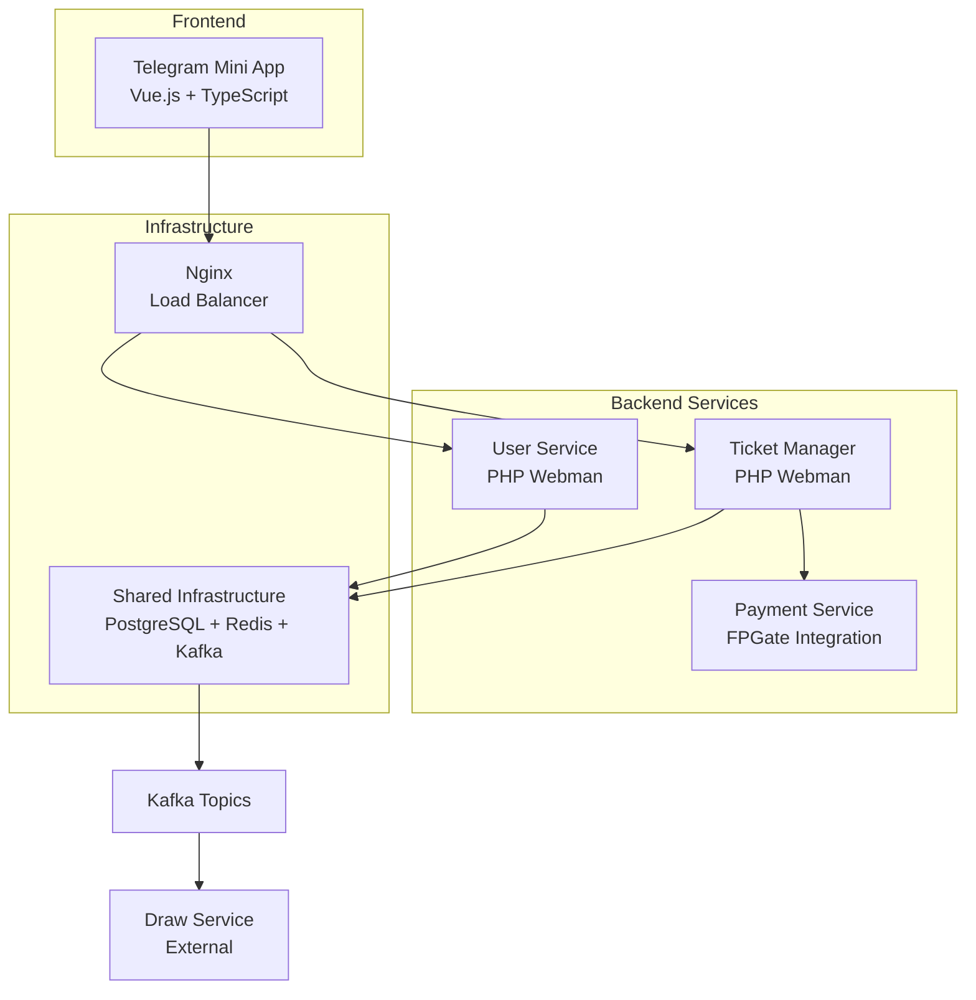

# 🎰 ЛОТЕРЕЙНАЯ СИСТЕМА "LOTO"


## 📋 О ПРОЕКТЕ

**Loto** - это современная микросервисная лотерейная система, интегрированная с **Telegram Mini Apps**. Система поддерживает различные типы лотерей, включая ежедневные, джекпот и супертур лотереи, с полной интеграцией платежных систем.

### ✨ ОСНОВНЫЕ ВОЗМОЖНОСТИ

- 🎭 **Telegram Mini App** интерфейс
- 🎟️ **Множественные типы лотерей** (дневные, джекпот, супертур)
- 💳 **Интеграция с платежными системами** (FPGate)
- 🪙 **Внутренние игровые механики** (тап-механика, колесо фортуны)
- 🌐 **Мультиязычность** (русский, узбекский)
- 🏆 **Автоматические розыгрыши** и распределение призов
- 📊 **Детальная аналитика** и статистика

---

## 🏗️ АРХИТЕКТУРА СИСТЕМЫ



---

## 📁 СТРУКТУРА ПРОЕКТА

```
Loto/
├── 🎭 l-ms-telegram-app/     # Frontend - Telegram Mini App
├── 🎟️ l-ms-ticket-manager/   # Backend - Управление билетами и лотереями  
├── 👤 l-ms-user/             # Backend - Управление пользователями
├── 🏗️ l-shared-infra/        # Общая инфраструктура (PostgreSQL, Redis, Kafka)
├── 📊 ANALYSIS_REPORT.md     # Подробный анализ и выявленные проблемы
├── 🚀 START.md               # Инструкции по запуску
└── 📖 README.md              # Этот файл
```

---

## 🛠️ ТЕХНОЛОГИЧЕСКИЙ СТЕК

### Frontend (l-ms-telegram-app)
- **Vue.js 3** + **TypeScript** + **Vite**
- **Telegram Web App SDK** 
- **Pinia** для управления состоянием
- **Axios** для HTTP запросов

### Backend (l-ms-ticket-manager, l-ms-user)  
- **PHP 8.3** + **Webman Framework**
- **PostgreSQL** база данных
- **Kafka** для межсервисного взаимодействия
- **Redis** для кеширования
- **JWT** авторизация

### Infrastructure (l-shared-infra)
- **Docker** + **Docker Compose**
- **PostgreSQL 15**
- **Redis 7**  
- **Apache Kafka 3.4**
- **Nginx** reverse proxy

---

## 🎮 БИЗНЕС-ЛОГИКА

### 🎯 ТИПЫ ЛОТЕРЕЙ

| Тип | Описание | Особенности |
|-----|----------|-------------|
| **Дневная (Фиксированная)** | $100 приз | Фиксированная сумма выигрыша |
| **Дневная (Динамическая)** | Приз от билетов | Призовой фонд зависит от продаж |
| **Джекпот** | 15-дневная | Накопительный приз |  
| **Супертур** | Ограничено билетов | Фиксированный призовой фонд |

### 🪙 ИГРОВЫЕ МЕХАНИКИ
- **Тап-механика**: До 5 тапов в день = 5 монет
- **Колесо фортуны**: Раз в 3 часа, призы: билеты/монеты
- **Внутренняя валюта**: Можно покупать билеты за монеты

---

## 🚀 БЫСТРЫЙ СТАРТ

> 📘 **Подробные инструкции**: См. [START.md](./START.md)

```bash
# 1. Запустить инфраструктуру
cd l-shared-infra && docker-compose up -d

# 2. Запустить бэкенд сервисы  
cd ../l-ms-ticket-manager && make up
cd ../l-ms-user && make up

# 3. Запустить фронтенд
cd ../l-ms-telegram-app/app && npm run dev
```

---

## 📊 СТАТУС РАЗРАБОТКИ

| Компонент | Статус | Готовность | Замечания |
|-----------|---------|------------|-----------||
| **Frontend** | ✅ Ready | 90% | Полнофункциональный |
| **User Service** | ✅ Ready | 85% | Базовый функционал готов |  
| **Ticket Manager** | ⚠️ Development | 70% | **Содержит заглушки** |
| **Infrastructure** | ✅ Ready | 95% | Production ready |

> ⚠️ **ВАЖНО**: Система содержит тестовые заглушки и не готова к продакшену. См. [ANALYSIS_REPORT.md](./ANALYSIS_REPORT.md)

---

## 🔧 РАЗРАБОТКА

### Предварительные требования
- **Docker** 20.0+
- **Docker Compose** 2.0+
- **Node.js** 18+ (для фронтенда)
- **PHP** 8.3+ (для локальной разработки)

### Локальное окружение
```bash
# Клонирование
git clone <repository> loto
cd loto

# Инфраструктура
cd l-shared-infra
docker-compose up -d

# См. START.md для детальных инструкций
```

### Полезные команды
```bash
# Логи всех сервисов
make logs

# Миграции базы данных  
make migrate

# Тесты
make test

# Мониторинг Kafka
open http://localhost:81
```

---

## 🛡️ БЕЗОПАСНОСТЬ

- 🔐 **JWT авторизация** через Telegram
- 🔒 **HMAC-SHA256** подписи для платежей  
- ⚡ **Rate limiting** для API endpoints
- 🔍 **Input validation** на всех уровнях
- 📝 **Детальное логирование** всех операций

---

## 📈 МОНИТОРИНГ И НАБЛЮДАЕМОСТЬ  

### Доступные интерфейсы:
- **Kafka UI**: http://localhost:81
- **PostgreSQL**: localhost:54320
- **Redis**: localhost:63790
- **Application logs**: `runtime/logs/` в каждом сервисе

### Health Checks:
```bash  
# Проверка статуса всех сервисов
curl http://localhost:8084/api/health  # Ticket Manager
curl http://localhost:8085/api/health  # User Service
```

---

## 🤝 УЧАСТИЕ В РАЗРАБОТКЕ

1. **Fork** репозитория
2. Создайте **feature branch** (`git checkout -b feature/amazing-feature`)  
3. **Commit** изменения (`git commit -m 'Add amazing feature'`)
4. **Push** в branch (`git push origin feature/amazing-feature`)
5. Откройте **Pull Request**

### Стандарты кода:
- **PSR-12** для PHP
- **ESLint + Prettier** для TypeScript
- **Conventional Commits** для сообщений

---

## 📞 ПОДДЕРЖКА

- 📧 **Email**: support@loto.example.com
- 💬 **Telegram**: @loto_support
- 🐛 **Issues**: [GitHub Issues](https://github.com/username/loto/issues)
- 📖 **Documentation**: См. README файлы в каждом сервисе

---

## 📄 ЛИЦЕНЗИЯ

Distributed under the MIT License. See `LICENSE` for more information.

---

## 🔗 СВЯЗАННЫЕ ДОКУМЕНТЫ

- 📊 [ANALYSIS_REPORT.md](./ANALYSIS_REPORT.md) - Детальный анализ проблем и заглушек
- 🚀 [START.md](./START.md) - Пошаговые инструкции по запуску
- 🏗️ [l-shared-infra/README.md](./l-shared-infra/README.md) - Настройка инфраструктуры  
- 🎟️ [l-ms-ticket-manager/README.md](./l-ms-ticket-manager/README.md) - API документация
- 👤 [l-ms-user/README.md](./l-ms-user/README.md) - Пользовательский сервис

---

<div align="center">
  <strong>🎰 Сделано с ❤️ командой Loto</strong>
</div>

---

<div align="center">
  <strong>🎰 Сделано с ❤️ командой Loto</strong>
</div>
